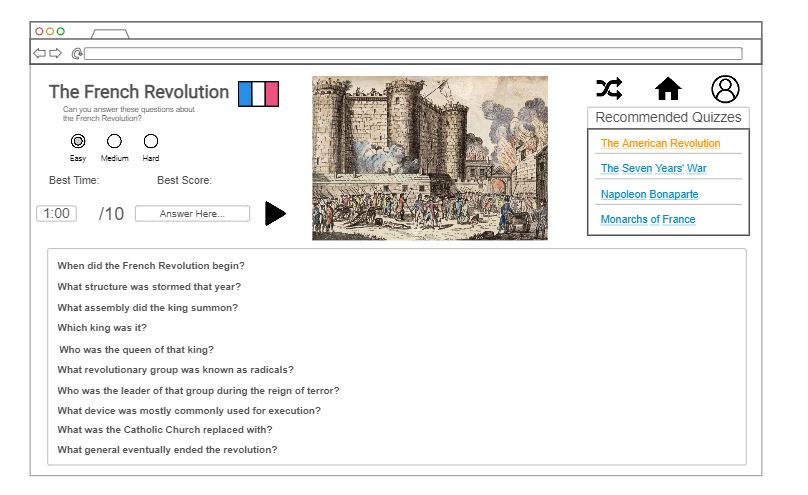

# History Trivia Site

## Specification Deliverable

### Elevator pitch

Are you an avid enjoyer of history? Want to test your knowledge against friends and others? This History Trivia site specializes in testing historical facts and general knowledge with a multitude of different topics, difficulties, and types of quizzes. The more quizzes you complete successfully, the higher overall score your account will have, and you can unlock higher ranks complete with bragging rights. To defend your knowledge you can even challenge friends or play co-op and work together.

### Design

### Key features

- Secure login over HTTPS (optional) - only needed if score is to be saved with account
- Ability to select easy/medium/hard which will change questions/number of questions
- Ability to answer questions through the box (which will accept a few similar versions)
- Time limit and score tally - can be saved with account
- Ability to switch to different quiz or random quiz
- (Hopefully) Ability for multiplayer play (challenge/ co-op quizzes)
- (Maybe) Ability for users to create and maybe publish quizzes

### Technologies

I am going to use the required technologies in the following ways.

- **HTML** - HTML to structure the webpages on the site. HTML home page and additional pages for different quizzes easy/medium/hard - navigate with hyperlinks. Additional log-in page as well.
- **CSS** - CSS to style text, background, whitespace, etc to look pleasing on different devices
- **Javascript/React** - Provides login, difficulty selection, text input, timer/score tally, possible form for user quizzes, real-time feedback, and use of React for routing and components.
- **Service** - Backend service with endpoints for:
  - login
  - saving scores
  - saving times
  - saving user level
  - creating/publishing quizzes
- **DB/Login** - Store users, scores, times, levels in database. Register and login users. Credentials securely stored in database.
- **WebSocket** - multiplayer challenges/ co-op with real-time score/answer updates

HTML

I created my basic website html, including one quiz. With this basic template I can eventually create many more quizzes. I also have placeholders for what javascript and react will eventually do, including the radio buttons for difficulty which will alter the display settings for the quiz tables. Also on the profile page after you log in it will show your user data (currently showing because not set up yet).

Application data - FrenchRevQuiz.html (all buttons, inputs, etc related to this) 

Authentication - profile.html (login placeholders) 

Database data - leaderboard data, user data 

websocket data - real-time leaderboard, comments

CSS

I created a theme for the website and styled all existing html pages with css files. The same pages are still available, and with the quiz css file it can be a template for other quizzes eventually. Also for the time being some things are showing even though they may eventually only show after an action (button click, login, etc). Also I'm aware this development period didn't have spread out commits, I will work on this in the future.

Javascript/React

I created the main functionality of the website so that the French Rev quiz works now and has difficulty settings, points, a timer, etc. Currently this is the only quiz that has been created so far but it demonstrates the functionality and wouldn't be too difficult to add more using this template in the future. I also made the site pages navigate using react (and converted everything and the site itself into using vite/react) and added a basic login system for the local system which shows information in the profile tab. The leaderboard is inactive currently but will be added when the websocket/database part of the startup is made. Also, for now I changed one of the navbar options to quiz (which just routes to the french rev quiz) because no other ones are currently made. the login/local system stuff is still a little finicky but this can be ironed out when its main functionality is made. It is sort of a placeholder right now

Service

I added a backend and made calls to its service endpoints (for scores, times, users, etc) and to another api (cat pics). Login is still a little finicky with clearing data after logout and etc but this can be fixed in later parts. Also in the process of changing this the recommended box in a few pages got messed up because of some missing or misplaced div elements. I'll fix this in later parts as well. 
